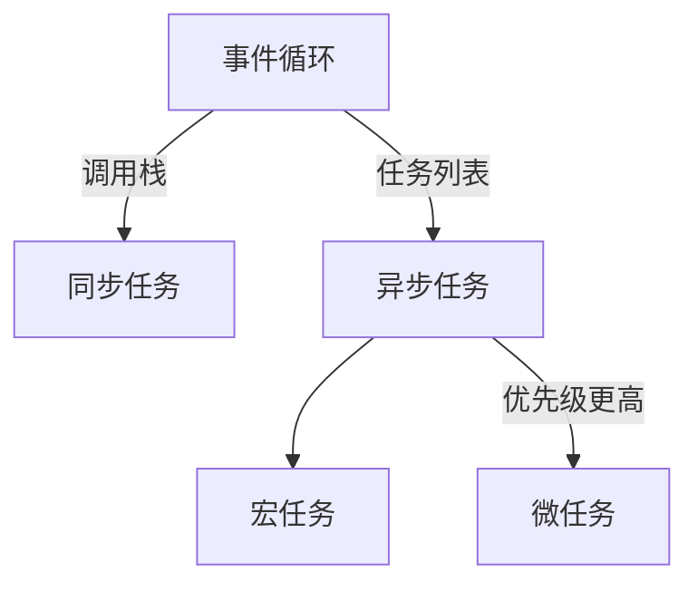
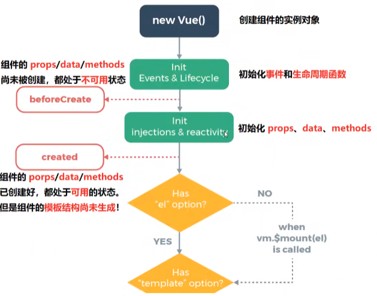
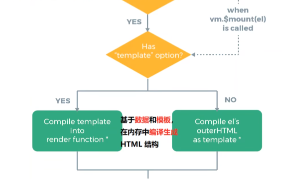
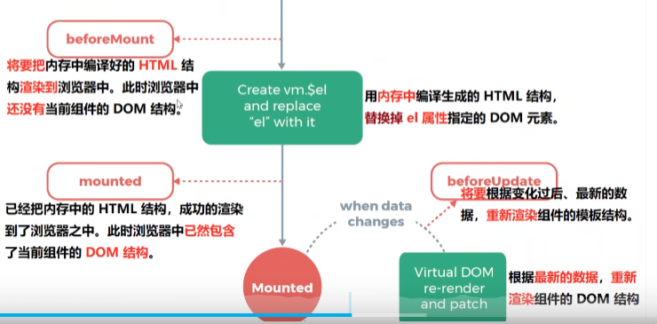
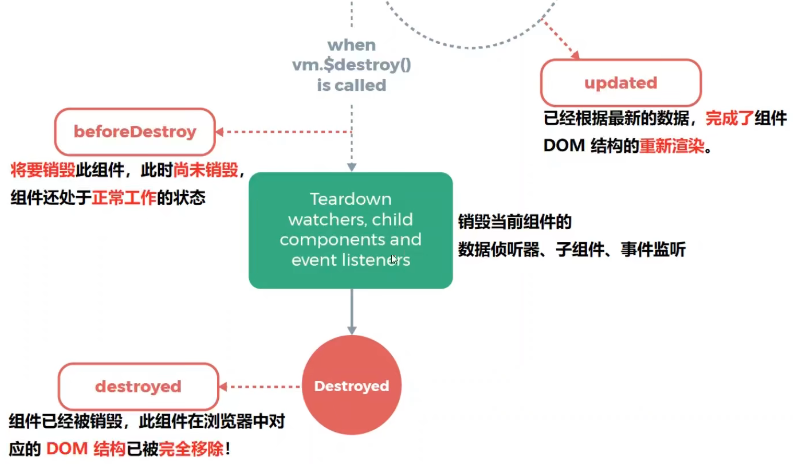

盒模型，水平垂直居中，事件流，事件循环，vue 的生命周期，vue 的 v-if 和 v-show 区别

### 一、盒模型

- 块级盒子 (block box) 和 内联盒子 (inline box)。
  通过对盒子 display 属性的设置，比如 inline 或者 block ，来控制盒子的外部显示类型。（外部显示类型）
- 内部显示类型：通过使用类似 flex 的 display 属性值来更改内部显示类型。如果设置 display: flex，在一个元素上，外部显示类型是 block，但是内部显示类型修改为 flex。该盒子的所有直接子元素都会成为 flex 元素，会根据弹性盒子（Flexbox）规则进行布局

### 二、事件流

事件流描述的是从页面中接收事件的顺序，事件被触发时会在元素节点之间按照特定的顺序传播，这个过程就是事件流。事件流分为捕获阶段、目标阶段、冒泡阶段三个阶段，我们可以利用这些特性进行一些应用，比如事件委托等。

### 三、事件循环

- JavaScript 是一门单线程语言，指主线程只有一个。Event Loop 事件循环，其实就是 JS 引擎管理事件执行的一个流程（**JS 代码的执行顺序**），具体由运行环境确定。目前 JS 的主要运行环境有两个，浏览器和 Node.js。又分为**同步**任务和**异步**任务

- 宏任务包括：script(整体代码)、setTimout、setInterval、setImmediate(node.js 环境)、I/O、UI 交互事件
- 微任务包括：new promise().then(回调)、MutationObserver(html5 新特新)、Object.observe(已废弃)、process.nextTick（node 环境）
- 执行顺序
  先执行同步代码，
  遇到异步宏任务则将异步宏任务放入宏任务队列中，
  遇到异步微任务则将异步微任务放入微任务队列中，
  当所有同步代码执行完毕后，再将异步微任务从队列中调入主线程执行，
  微任务执行完毕后再将异步宏任务从队列中调入主线程执行，
  一直循环直至所有任务执行完毕。
  注意：当宏任务和微任务都处于 任务队列（Task Queue） 中时，**微任务的优先级大于宏任务**，即先将微任务执行完，再执行宏任务；

### 四、Vue 的生命周期

**避免用箭头函数来定义生命周期钩子，因为如果这样的话你将无法在函数中通过 this 获取组件实例。**

### 五、水平垂直居中

#### 元素定宽高（知道元素宽高）

- 利用定位 + calc
  top: calc(50% - 子元素高度一半);
  left: calc(50% - 子元素宽度一半);
- 利用定位 + margin:负值

#### 元素不定宽高（不知道元素宽高）

- 利用定位 + margin:auto
  top: 0;
  bottom: 0;
  left: 0;
  right: 0;
- 利用定位 + transform
  flex 布局
  grid 布局(类似 flex)
  table 布局

### 五、vue 的 v-if 和 v-show 区别

v-if 是“真实的”按条件渲染，因为它确保了在切换时，条件区块内的事件监听器和子组件都会被销毁与重建。
本质是通过**操纵 dom 元素**来进行切换显示
表达式的值为 true 的时候元素存在于 dom 树中，为 false 的时候从 dom 树中移除

v-if 也是惰性的：如果在初次渲染时条件值为 false，则不会做任何事。条件区块只有当条件首次变为 true 时才被渲染。

相比之下，v-show 简单许多，元素无论初始条件如何，始终会被渲染，**只有 CSS display 属性会被切换**。

总的来说，v-if 有更高的切换开销，而 v-show 有更高的初始渲染开销。因此，如果**需要频繁切换，则使用 v-show 较好**；如果在**运行时绑定条件很少改变，则 v-if 会更合适**。

### 六、forEach 和 map 的区别

- foreach 和 map 的共同点：

(1)都是循环遍历数组中的每一项。

(2)每次执行匿名函数都支持三个参数，参数分别为 item(当前每一项)，index(索引值)，arr(原数组)。

(3)匿名函数中的 this 都是指向 window。

(4)只能遍历数组。

- 不同点：

**(1)map()会分配内存空间存储新数组并返回，forEach()不会返回数据。**

map 遍历的后的数组通常都是生成一个新的数组，新的数组的值发生变化，当前遍历的数组值不会变化。

(2)**forEach()允许 callback 更改原始数组的元素**。map()返回新的数组。

forEach 遍历通常都是直接引入当前遍历数组的内存地址，生成的数组的值发生变化，当前遍历的数组对应的值也会发生变化。

#### .sync:vue2 的双向绑定语法，vue3 直接用 v-model

// upload test
