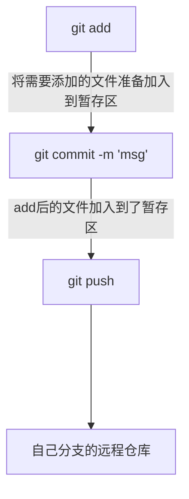
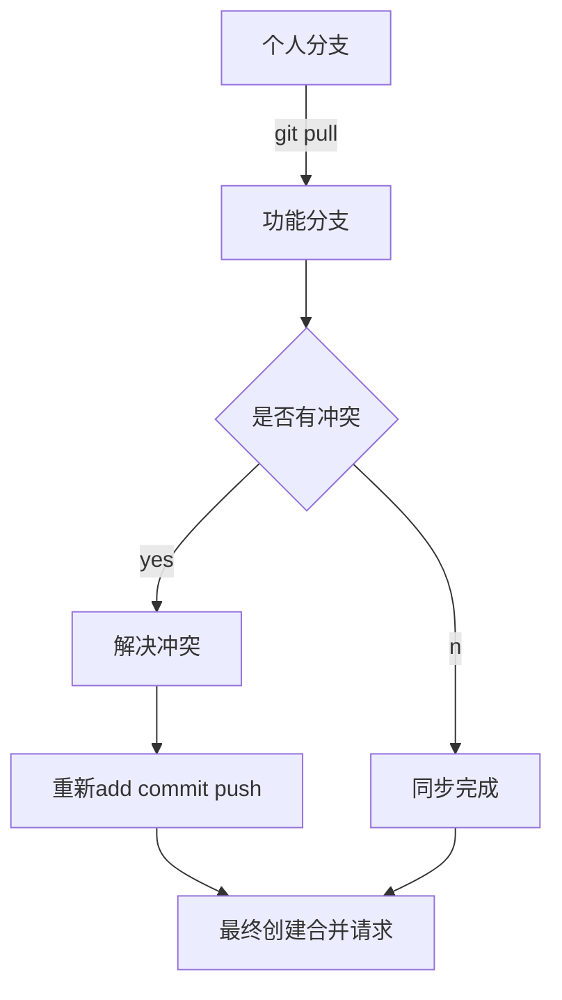

## git 常用命令

### 创建合并请求前的操作

因为功能分支的代码有很多人提交跟合并，所以自己的个人分支没有 pull(更新)的话，2 个分支是不同步的，如果直接创建合并请求，那么就可能这个合并请求会有冲突，解决冲突要在本地解决最好，原因有 2 个：

- 网页 gitlab 不能解决复杂的冲突
- 审核人不知道你的代码哪些需要合并，哪些不需要，可能会造成合并代码错误

## 总结

> 1.要记得推送自己的代码到个人远程分支，保证远程分支有自己代码的备份，即使电脑坏了，也可以找到备份恢复，就不需要重写了。 2.如果远程功能分支与自己个人分支偏离版本太多了，记得要 pull 远程分支。 3.在开发新需求的时候，记得先 pull 远程分支，同步版本，越早同步，冲突越少。

// upload test
