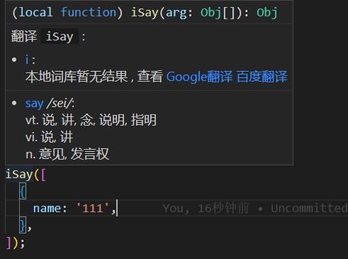

1、

```javascript
interface Obj {
  name: string;
}

function iSay(arg: Obj[]): Obj {
  console.log(arg.length);
  return arg[0];
}

iSay([
  {
    name: '111',
  },
]);
```

现在 isSay 是固定的返回，如下图


怎么让他变成动态的类型推断，isSay 入参的对象，是动态的，能够获取入参对象的返回——利用**泛型**


```javascript
interface Obj {
  name: string;
}

function iSay<T>(arg: T[]): T {
  console.log(arg.length);
  return arg[0];
}

iSay([
  {
    name: '111',
    age: 123,
  },
]);
```

如何限定这个 T 只能是对象——**利用 extends ——泛型约束**

```javascript
    interface Obj {
     name: string
    }
// 这里是限制为只能是对象
    function iSay<T extends Record<string, any>>(arg: T[]): T {
     console.log(arg.length);
     return arg[0];
    }
// 这里是限制在Obj的基础上，没有name属性不行
    function iSay<T extends Obj >(arg: T[]): T {
     console.log(arg.length);
     return arg[0];
    }

    iSay([{
       name: '111',
       age: 123,
      }]);
```

2、infer 关键字

```javascript
    type ReturnType<T> = T extends (
        ...args: any[]
       ) => infer R ? R : T;
    // 等价于以下形式：
    type GetRest<T> = T extends infer Rest ? Rest : T;
// 如何让他能获取到除了第一项，之后的数组？

        type GetRest<T extends number[]> = T extends [infer start, ...infer Rest] ? Rest : T;


const arr: GetRest<[1, 2, 3]>; //结果是[2, 3]
```

infer 相当于占位符，将传入的参数保存到变量中，这里的 start 是 1，Rest 是[2, 3]
这里的意思是如果传进来的 T 的形式是[1, 2, 3]的话，就返回[2, 3]，否则返回 T，所以需要...infer Rest， 否则 T 不满足[1, [2, 3]]，返回的结果就是[1, 2, 3]

3、keyof
原题：

```javascript
const getVal = (obj: Record<string, unknown>, key: string) => {
  return obj[key];
};

const obj = {
  name: 'kiana',
  age: 100,
};

getVal(obj, 'name');
```

要求：实现 getVal 的自动推断 obj 的 key，当传入第一个参数 obj 对象时，第二个参数能自动推断 obj 对象有哪些 key，如图：


利用泛型工具 key of，获取传入的类型的 key

```javascript
  const getVal = <T extends Record<string, unknown>>(obj: T, key: keyof T) => {
     return obj[key];
    };

    const obj = {
     name: 'kiana',
     age: 100,
    };

    getVal(obj, '');

```

4、第 3 题进阶, 实现 pick 函数的类型推断，能够自动推断出传入第一个参数 obj 的时候，第二个参数的数组,受到第一个参数的限定，要是字符串数组，并且值只能是一个或多个第一个参数 obj 的 key

```javascript
const pick = (obj: Record<string, any>, arr: any[]) => {
  const _obj: any = {};
  for (const key in obj) {
    if (arr.includes(key)) {
      _obj[key] = obj[key];
    }
  }
  return _obj;
};

pick({ a: '1', b: '2' }, ['a']);
```

错误的点：arr 不知道如何定义为字符串数组，keyof T 拿到的只是字符串，如何让 arr 是字符串数组呢？非常低级的错误，因为我忘记了在 TS 中怎么定义字符串数组，不会举一反三，
定义字符串数组 —— arr: string[]; 定义限定字符的字符串数组： arr: (keyof T)[]

```javascript
  const pick = <T extends Record<string, unknown>>(obj: T, arr: (keyof T)[]) => {
     const _obj: any = {};
     for (const key in obj) {
       if (arr.includes(key)) {
       _obj[key] = obj[key];
      }
     }
     return _obj;
    };

    pick({ a: '1', b: '2' }, ['a']); //传入的第二个参数是['c']就会报错
```

5、实现 Readonly
不要使用内置的 Readonly<T>，自己实现一个。

该 Readonly 会接收一个 泛型参数，并返回一个完全一样的类型，只是所有属性都会被 readonly 所修饰。

也就是不可以再对该对象的属性赋值。

例如：

```javascript
interface Todo {
  title: string
  description: string
}

const todo: MyReadonly<Todo> = {
  title: "Hey",
  description: "foobar"
}

todo.title = "Hello" // Error: cannot reassign a readonly property
todo.description = "barFoo" // Error: cannot reassign a readonly property
```

实现：

```javascript
interface Todo {
  title: string
  description: string
}

type MyReadonly<T> = {
  readonly [P in keyof T]: T[P];
}

// 这个in操作符，其实就是遍历操作
// 后面有些题目，如果对于对象的话，就用这个进行遍历，或者将某个东西转换成对象，进行遍历
// 对象的中括号可以写表达式，这种称为动态key

const todo: MyReadonly<Todo> = {
  title: "Hey",
  description: "foobar"
}
```

6、元组转换为对象
传入一个元组类型，将这个元组类型转换为对象类型，这个对象类型的键/值都是从元组中遍历出来。

```javascript
const tuple = ['tesla', 'model 3', 'model X', 'model Y'] as const

type result = TupleToObject<typeof tuple> // expected { tesla: 'tesla', 'model 3': 'model 3', 'model X': 'model X', 'model Y': 'model Y'}
```

实现

```javascript
  const tuple = ['tesla', 'model 3', 'model X', 'model Y'] as const;

  type TupleToObject<T extends readonly string[]> = {
    [P in T[number]]: P;
  }

  // 关键在于T[number]，不知道要用T[number]读取元组的值，并且注意只有只读的数组，才能做到拿到它们的值，如果是普通的数组
  type result = TupleToObject<typeof tuple>
```


