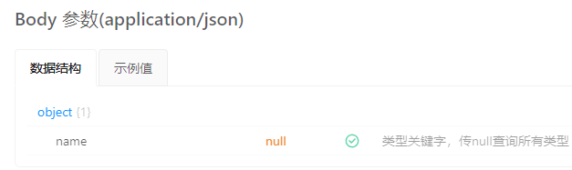

### 接口传参问题

后端显示的接口参数数据为 object，则请求头的 data 也应该用对象形式


```javascript
  const request = {
    method: 'post',
    service: '',
    headers: {
      'Content-Type': 'application/json',
    },
    url: '/ser/wgl/enterpriseType/listTree',
    data: { name: null }, // 则我这里应该这么用，而不是
    // data: name, 确定吗？这种写法也成功调用了
```

### 弹框传参问题

弹框是创建了一个新的 dom,因此它不是调用者的子组件，无法用 props 直接传给 DynamicDialog，但可以向创建弹框的函数$openDynamicMapDialog 传 props 参数，在 DynamicDialog 中再将 props 数据传递给弹框的子组件，由于涉及到多层调用，因此可以使用 provide、inject 注射到子组件中，在子组件中使用自己想要的参数。

### Q：点击对应任务列表，如何拿到对应任务列表的所有内容，并传给二级页面显示出来？

A： 在 useInit 中写一个全局变量 currentTaskItem，存储当前的任务列表的数据，点击列表的时候将列表的数据存入，跳转到二级页面中也可以使用 currentTaskItem 的数据，纠正我之前以为只能保存当前任务列表的 id 的思想。
法 2：~~每个组件都是一个实例，在一级页面中暴露当前列表的数据，再在父组件中获取到数据，传给二级页面~~
此方法不可行，但是暴露这个概念是第一次听说，需要学习（用了 instance 获取实例，用了 defineExpose 暴露出去）

// upload test
