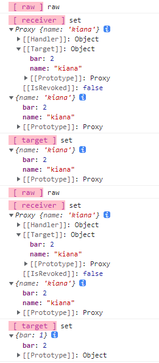

### 从原型上继承属性的代理

```javascript
const obj = {};
const proto = { bar: 1 };
const child = reactive(obj);
const parent = reactive(proto);
// 使用 parent 作为 child 的原型
Object.setPrototypeOf(child, parent);

effect(() => {
  console.log(child.bar); // 1
});
// 修改 child.bar 的值
child.bar = 2; // 会导致副作用函数重新执行两次
```

由于 child 代理的对象 obj 自身没有 bar 属性，因此会获取对象 obj 的原型，也就是 parent 对象，所以最终得到的实际上是 parent.bar 的值。但是大家不要忘了，parent 本身也是响应式数据，因此在副作用函数中访问 parent.bar 的值时，会导致副作用函数被收集，从而也建立响应联系。所以我们能够得出一个结论，即 child.bar 和 parent.bar 都与副作用函数建立了响应联系。

读取 child.bar -- Reflect.get(obj, 'bar', receiver),receiver 是 child --> get obj.bar（无）-- 获取其原型 parent.bar --> parent.bar 建立响应联系

#### 那么为什么副作用函数会重新执行两次呢？

**如果设置的属性不存在于对象上，那么会取得其原型，并调用原型的 [[Set]] 方法，也就是 parent 的 [[Set]] 内部方法。**也就是 parent 的 [[Set]] 内部方法。由于 parent 是代理对象，所以这就相当于执行了它的 set 拦截函数。就会触发副作用函数重新执行，这就是为什么修改 child.bar 的值会导致副作用函数重新执行两次。

**如何解决？** ——屏蔽其中一次，在 set 拦截函数内区分这两次更新，从 receiver 入手

当我们设置 child.bar 的值时，会执行 child 代理对象的 set 拦截函数，此时的 set(target, key, value, receiver) 传入的 receiver 就是 child 本身，target 是 obj，但是由于 obj 上不存在 bar 属性，去取得 obj 的原型 parent，并执行 parent 代理对象的 set 拦截函数，但此时的 target 是原始对象 proto，而 receiver 仍然是 child（原型 set 操作的上下文环境仍然在 child 内），所以区分这两次更新，只需要判断 receiver 是否是 target 的代理对象即可。

**那么如何判断 receiver 是否是 target 的代理对象呢**

```javascript
   function reactive(obj) {
   return new Proxy(obj {
     get(target, key, receiver) {
       // 代理对象可以通过 raw 属性访问原始数据
       if (key === 'raw') {
         return target
       }

       track(target, key)
       return Reflect.get(target, key, receiver)
     }
     // 省略其他拦截函数

     set(target, key, newVal, receiver) {
       const oldVal = target[key]
       const type = Object.prototype.hasOwnProperty.call(target, key) ? 'SET' : 'ADD'
       const res = Reflect.set(target, key, newVal, receiver)

       // target === receiver.raw 说明 receiver 就是 target 的代理对象
       if (target === receiver.raw) {
         if (oldVal !== newVal && (oldVal === oldVal || newVal === newVal)) {
           trigger(target, key, type)
         }
       }

       return res
     }
     // 省略其他拦截函数
   })
 }
```

在 set 拦截函数中，进行 target === receiver.raw 判断，为什么能 receiver.raw 拿到原始对象呢？
——关键点在于，忽略了 receiver 代理对象本身就是一个响应式数据，当进行 receiver.raw 操作时，其实会触发 receiver 的 get 操作（这里的 receiver 其实就是 child），get(target=obj, key=raw, receiver=child)，判断 key === 'raw'为 true，所以会返回 target——所代理的原始对象 obj，如果这次更新是对 parent 操作的，此时 target 为 proto，而 receiver.raw 返回 obj，所以 target === receiver.raw 为 false，就不会触发由 parent.bar 的那次副作用函数的重新执行。

**验证：**

```javascript
const obj = { name: 'kiana' };
const proto = { bar: 1 };

function reactive(obj) {
  return new Proxy(obj, {
    get(target, key, receiver) {
      if (key === 'raw') {
        console.log(
          '%c [ raw ]',
          'font-size:13px; background:pink; color:#bf2c9f;',
          key
        );
        return target;
      }
      return Reflect.get(target, key, receiver);
    },
    set(target, key, newVal, receiver) {
      console.log(
        '%c [ receiver ]',
        'font-size:13px; background:pink; color:#bf2c9f;',
        'set',
        receiver,
        receiver.raw
      );
      console.log(
        '%c [ target ]',
        'font-size:13px; background:pink; color:#bf2c9f;',
        'set',
        target
      );

      return Reflect.set(target, key, newVal, receiver);
    },
  });
}

let child = reactive(obj);
let parent = reactive(proto);

Object.setPrototypeOf(child, parent);

child.bar = 2;
```

运行结果为


由此可知，set 操作确实会被执行两次，receiver 始终未代理对象 child，第一次 target 是 obj,第二次的 target 为 proto，所以需要判断 target === receiver.raw 的结果才能 true 才能执行 trigger。
