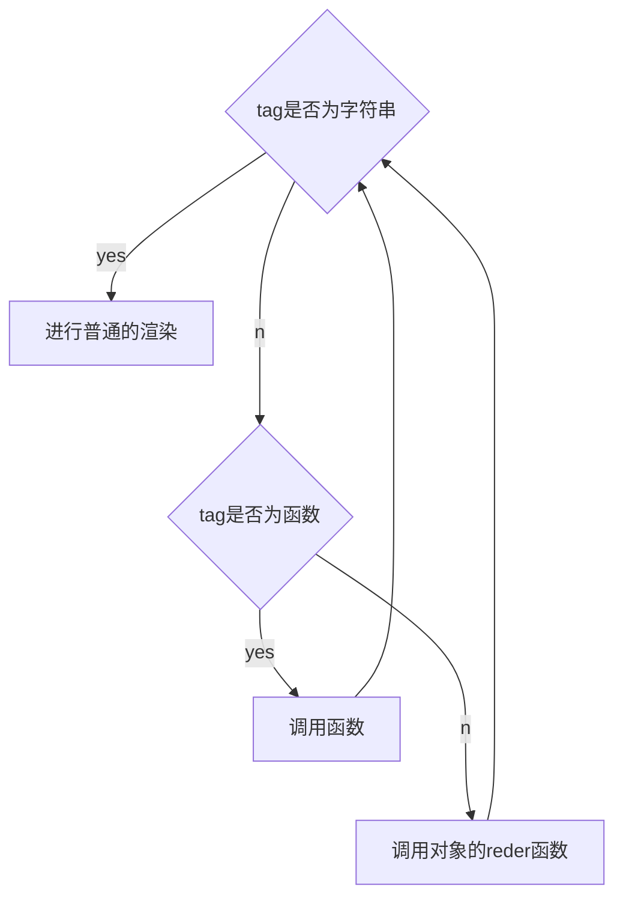

### 03-vue,js 的设计思路

#### 虚拟 dom

使用 JavaScript 对象来描述 UI 的方式，其实就是所谓的虚拟 DOM

```javascript
  const title = {
  // 标签名称
  tag: 'h1',
  // 标签属性
  props: {
    onClick: handler
  },
  // 子节点
 children: [
    { tag: 'span' }
  ]
 }

//  对应到 Vue.js 模板，其实就是：
 <h1 @click="handler"><span></span></h1>
```

两者的区别：使用 JavaScript 对象描述 UI 更加灵活，正是因为虚拟 DOM 的这种灵活性，Vue.js 3 除了支持使用模板描述 UI 外，还支持使用虚拟 DOM 描述 UI。

```javascript
import { h } from 'vue';

export default {
  render() {
    return h('h1', { onClick: handler }); // 虚拟 DOM
  },
};
```

h 函数的返回值就是一个对象，其作用是让我们编写虚拟 DOM 变得更加轻松，相当于

```javascript
export default {
  render() {
    return {
      tag: 'h1',
      props: { onClick: handler },
    };
    ji;
  },
};
```

#### 渲染器

渲染器：把虚拟 DOM 渲染为真实 DOM，Vue.js 组件都是依赖渲染器来工作的
**渲染器 renderer 的实现思路**，总体来说分为三步：

- 创建元素：把 vnode.tag 作为标签名称来创建 DOM 元素。
- 为元素添加属性和事件：遍历 vnode.props 对象，如果 key 以 on 字符开头，说明它是一个事件，把字符 on 截取掉后再调用 toLowerCase 函数将事件名称小写化，最终得到合法的事件名称，例如 onClick 会变成 click，最后调用 addEventListener 绑定事件处理函数。
- 处理 children：如果 children 是一个数组，就递归地调用 renderer 继续渲染，注意，此时我们要把刚刚创建的元素作为挂载点（父节点）；如果 children 是字符串，则使用 createTextNode 函数创建一个文本节点，并将其添加到新创建的元素内。

#### 组件本质

**组件就是一组 虚拟 DOM 元素的封装**，这组 DOM 元素就是组件要渲染的内容，因此我们**可以定义一个函数来代表组件**，而函数的返回值就代表组件要渲染的内容

```javascript
const MyComponent = function () {
  return {
    tag: 'div',
    props: {
      onClick: () => alert('hello'),
    },
    children: 'click me',
  };
};
```

组件的返回值也是虚拟 DOM，它代表组件要渲染的内容——可以定义用虚拟 DOM 来描述组件：

- 让虚拟 DOM 对象中的 tag 属性来存储组件函数，即此时 tag 代表一个函数，不再是一个字符串，注意举一反三，MyComponent 不一定非得是函数，也可以是一个对象，可以定义对象内部一个函数，返回组件要渲染的内容。

  ```javascript
  const vnode = {
    tag: MyComponent,
  };

  const MyComponent = function () {
    return {
      tag: 'div',
      props: {
        onClick: () => alert('hello'),
      },
      children: 'click me',
    };
  };
  ```

渲染器此时的工作逻辑大概如下



Vue.js 中的有状态组件就是使用对象结构来表达的

#### 编译器

编译器的作用其实就是将模板编译为渲染函数，所以，无论是使用模板还是直接手写渲染函数，对于一个组件来说，它要渲染的内容最终都是通过渲染函数产生的，然后渲染器再把渲染函数返回的虚拟 DOM 渲染为真实 DOM，这就是模板的工作原理，也是 Vue.js 渲染页面的流程。
如何实现只更新有改变的内容呢？编译器能识别出哪些是静态属性，哪些是动态属性，在生成代码的时候完全可以附带这些信息，直接交给渲染器，渲染器不就不需要花费大力气去寻找变更点。
即编译器和渲染器之间是存在信息交流的，它们互相配合使得性能进一步提升，而它们之间交流的媒介就是虚拟 DOM 对象。
