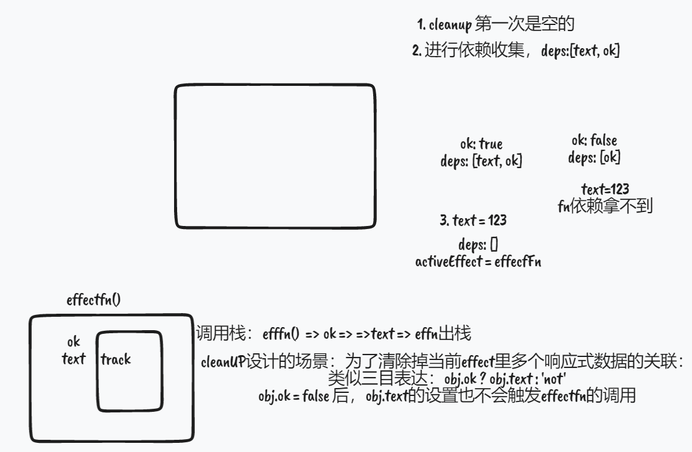
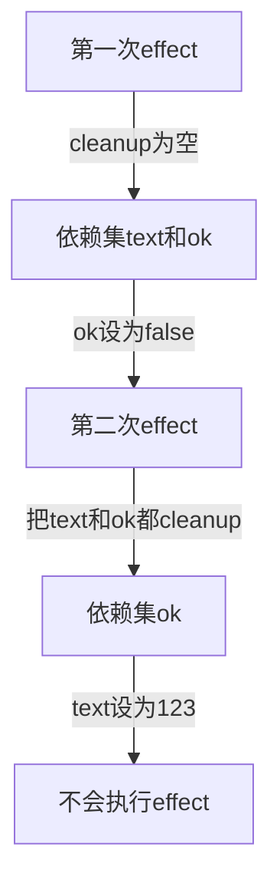

### 响应式数据基本概念

#### 基本概念

首先是我的疑惑，设计响应式系统的目的是什么？出发点是在于，与 dom 更新结合在一起吗？ 比如，dom 中某元素的属性绑定了一个变量值，当该变量值改变时，也应该执行改变这个属性的函数（即副作用函数）
啊，我悟了，原来 ref、computed、watch 都用到了响应式的概念，即是 effect 方法的延伸。**最重要的是更新 DOM**

响应式也可以用发布订阅的思想来看，我们定义的响应式数据就是发布者，与之相关的副作用是订阅者，当数据改变时，要执行相应的作用。

#### 实现的基本逻辑

基本思路：利用 Proxy 追踪对象属性的读写，在

// upload test
以上都是错误的，并不是发布订阅模式，而是**观察者模式**。
观察者模式与发布订阅模式虽然相似，但是还是存在很大的区别，比如发布订阅模式更强调动作（在 emit 这个动作被触发后才会通知订阅者）；
而观察者模式更强调数据的自动更新，在被观察者的数据更改时，自发地通知观察者。

#### 4.4 分支切换与 cleanup（解决遗留副作用的问题）

**场景：**当副作用函数中涉及到一些分支切换的情况时，或者其他会使某个元素不再使用该副作用的情况，但是如果不清除依赖集中的副作用，下次读写元素属性时还是会调用那个副作用函数
**解决思路：**
每次副作用函数执行时，先把它从所有与之关联的依赖集合中删除；


在 effect 函数中，是先读取 ok 的属性，然后再读取 text 的属性，所以大概的流程如下：



那么怎么做到收集所有与该副作用关联的依赖集合呢？
也是在 track 函数中收集，为 effect 函数增加一个属性 deps，用于保存与之关联的依赖集，那么为什么在 track 函数里是设置 activeEffect.deps.push(deps)，在 cleanup 里是清除

```javascript
// 在track函数里
2   // 把当前激活的副作用函数添加到依赖集合 deps 中
13   deps.add(activeEffect)
14   // deps 就是一个与当前副作用函数存在联系的依赖集合
15   // 将其添加到 activeEffect.deps 数组中
16   activeEffect.deps.push(deps) // 新增

// 在cleanup里
     const deps = effectFn.deps[i]
     // 将 effectFn 从依赖集合中移除
     deps.delete(effectFn)

    // 在effect函数内：
        // 当 effectFn 执行时，将其设置为当前激活的副作用函数
             activeEffect = effectFn

```

因为在 effect 函数内，activeEffect = effectFn 是*浅拷贝*，修改 activeEffect 也会修改 effectFn，同样的，effectFn.deps 中的依赖集也是浅拷贝了原来的数据集的依赖集，删掉 effectFn.deps 中的依赖集就相当于从原来的依赖集合中删掉对应的依赖集，这样在 trigger 中重新执行时，就不会执行遗留副作用。

```javascript
function trigger(target, key) {
  const depsMap = bucket.get(target);
  if (!depsMap) return;
  const effects = depsMap.get(key);
  const effectsToRun = new Set(effects); // 新增
  effectsToRun.forEach((effectFn) => effectFn()); // 新增
  // effects && effects.forEach(effectFn => effectFn()) // 删除
}
```
